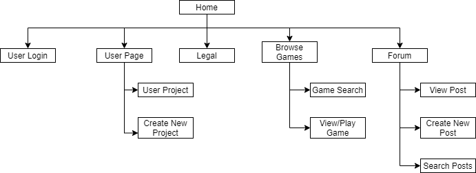
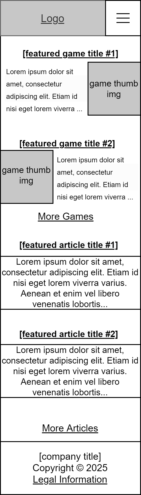
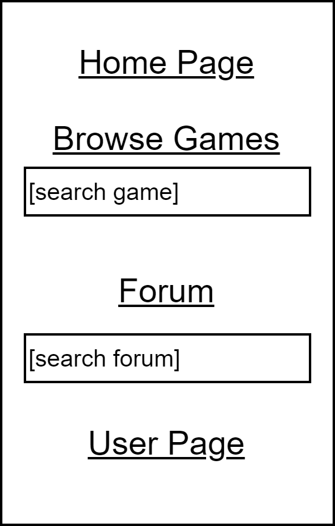
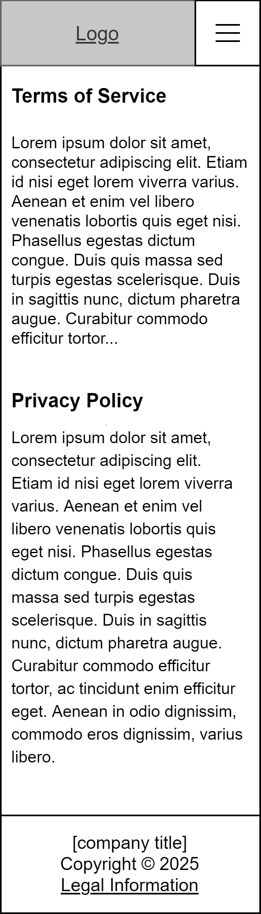
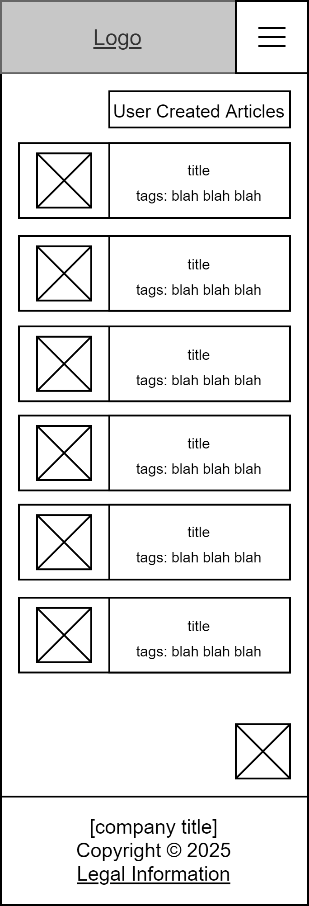
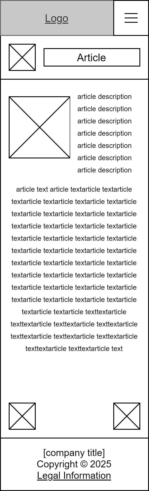
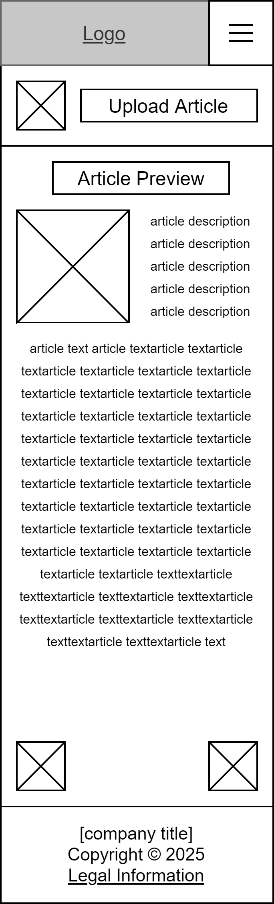
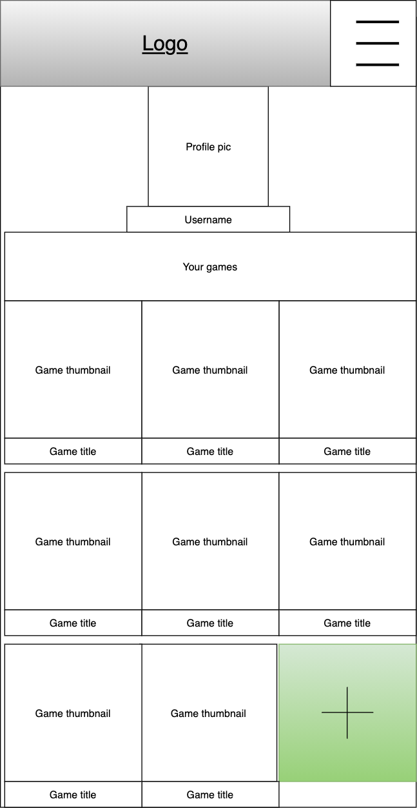
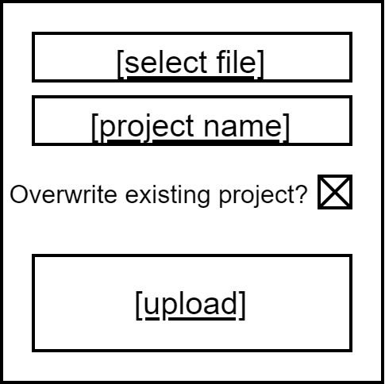

# User Experience Design

## App Map

There are four main categories of pages for our application: pages related to playing games, pages related to our forum, pages related to the User's page, and other auxillary pages (ex. the home page, or the legal information page).

## Home page and general layout

The home page features access to featured articles and games. 

From any page on the site, users can use the hamburger menu to access other pages, or click the logo to access the home page.

Users can also access legal information from anywhere by accessing the footer.

## Accessing Games

Players can search for or browse the selection of games.

Players can click any game to access the game, or from the game view the comments.

## Forum

Players can access articles similarly, by browsing or searching for them.

From the search page, users can click on an article to view the entire article, and return to the search page by clicking a back button at the top of the page.

Users can also create and upload their own articles, and view a preview of what the article will look like.

## User page

From the user page, users can view their current project.

Users can use the button at the bottom to add a new project. Users can update an existing project by giving it the same name, and choosing to overwrite the previous version.

